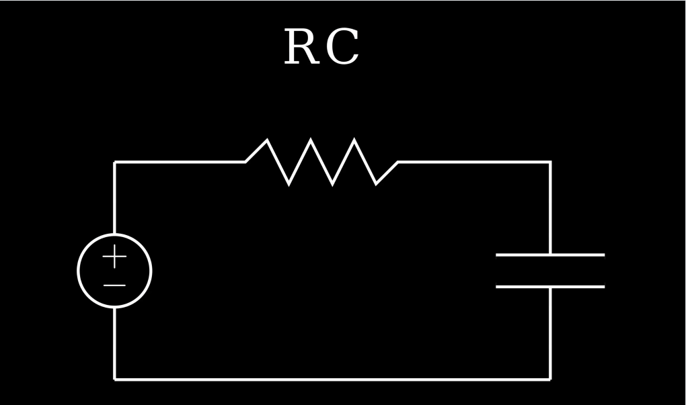

This project uses Python and the Manim library to create an animation showing that my name is equivalent to an RC circuit.
You can watch the full video on YouTube here: https://www.youtube.com/watch?v=kaxDuJ-4ksE 

